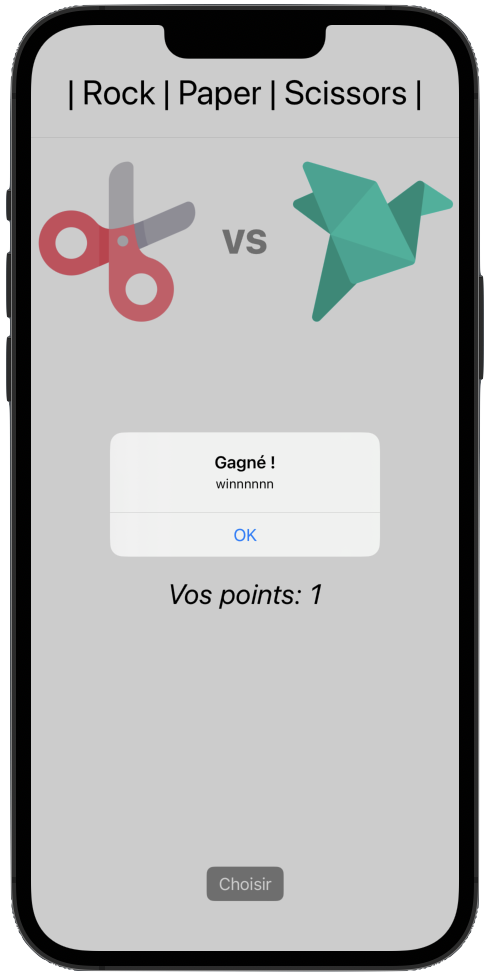
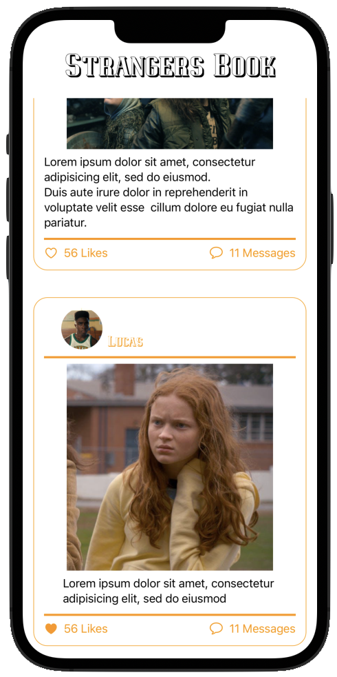

<!--
 * **********************************************************
 * Author: Balita Rakotonarivo								*
 * Date: September 2023										*
 * Context: Deliberate practice, as an iOS developper		*
 * Language: Swift 											*
 * **********************************************************
 isITfr33+

-->

# SwiftUI-Apps

Playing with *SwiftUI Views*, again and again.
It started from a joke that the genius in Aladdin also needs a portfolio.
There are also many other small apps or *Views* to test advanced DataFlow in SwiftUI, OpenWeather API Calls, MapKit, Interactables, layouts, ...

## Screenshots and Videos 

Here are some screenshots of the micro apps and views, some with a youtube link to see them in action. 
<a href="mailto:jery.sarim@gmail.com?subject=SwiftUI-GeniusApp">Contact me</a>  if you want to know/see more.

 
Genius Portfolio App, <a target=”_blank” href="https://youtu.be/hw9lIXuCE8c">watch demo on youtube</a>

 
Rock - Paper - Scissors App, <a target=”_blank” href="https://youtu.be/8kc1APgpa98">watch demo on youtube</a>

 
Weather App, <a target=”_blank” href="https://youtu.be/353HMmpiIVY">watch demo on youtube</a>

 
Food Order App, <a target=”_blank” href="https://youtu.be/_upaFP-u_D8">watch demo on youtube</a>

 
Social Network post feed 

 
Social Network photo gallery

## Tests

**As this work is primarily focused on views, I put no test at all.**

The repository for [Occitane de Banque](https://github.com/RaBalita/sw-arcade-bankey/) has some Tests samples.

## Credits

Some concepts of the example apps are taken from a [Udemy Course by Matthieu Passerel](https://www.udemy.com/course/ios15_french/), but I wrote the code as exercises - for deliberate practice. 

The *PracticeGenius/Assets.xcassets* and *Font* folders were removed, to avoid copyright issues.

## Contact

<a href="mailto:jery.sarim@gmail.com?subject=SwiftUI-GeniusApp">Let's get in touch.</a> 
